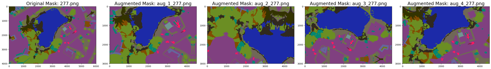
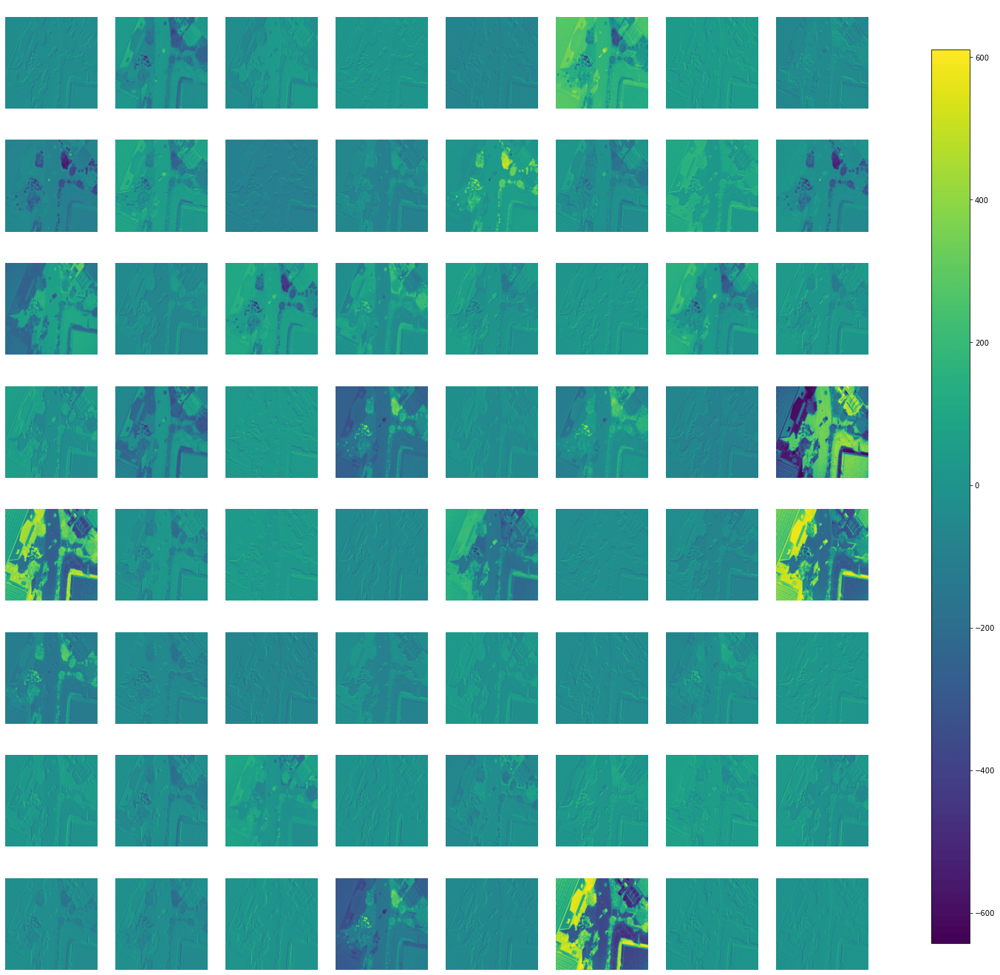
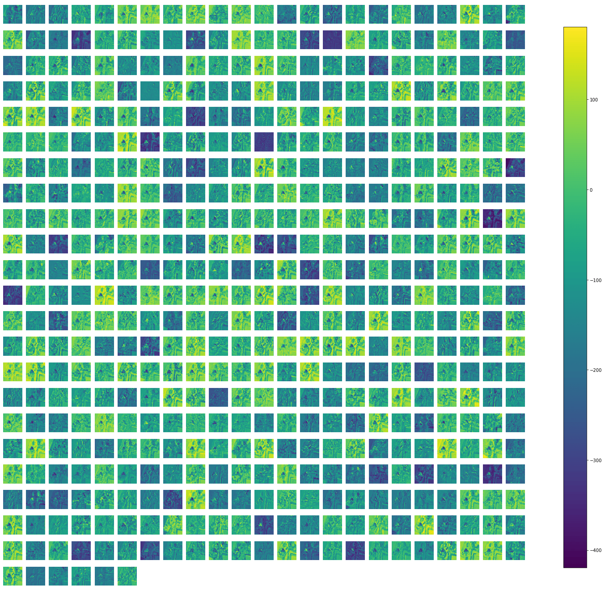
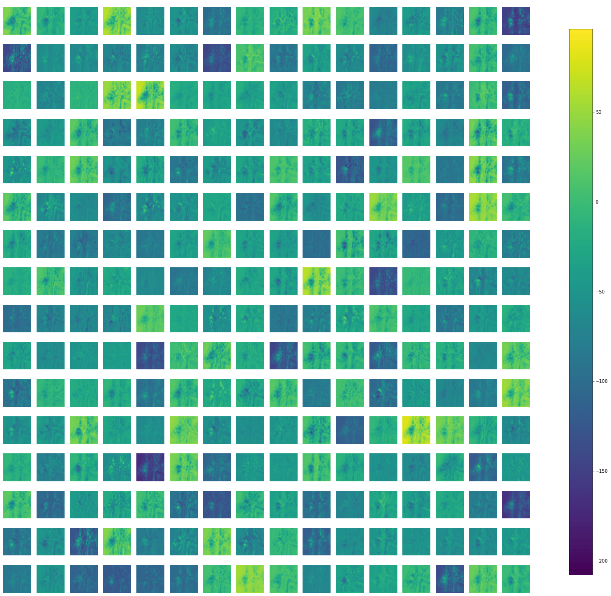
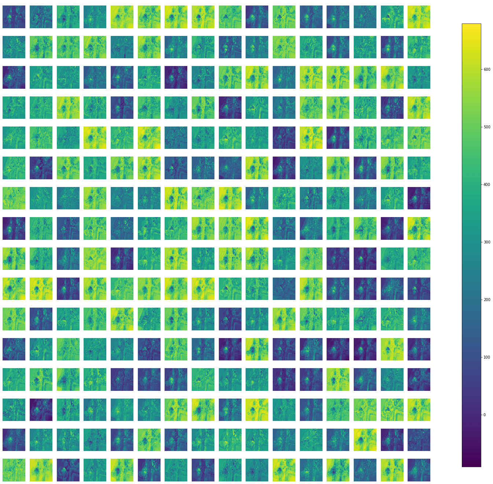
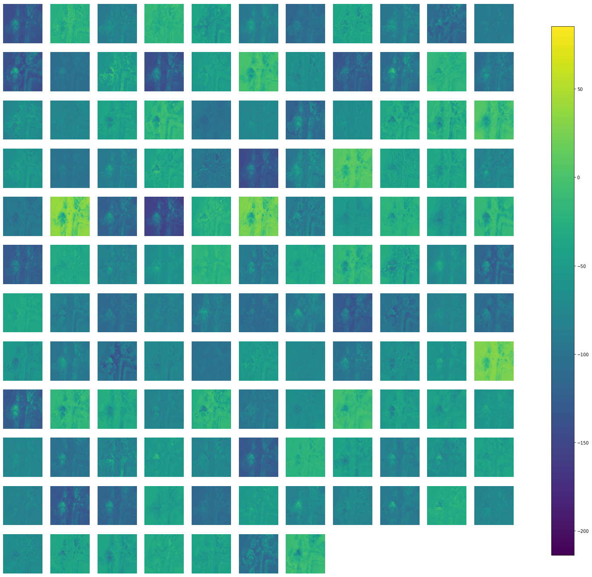
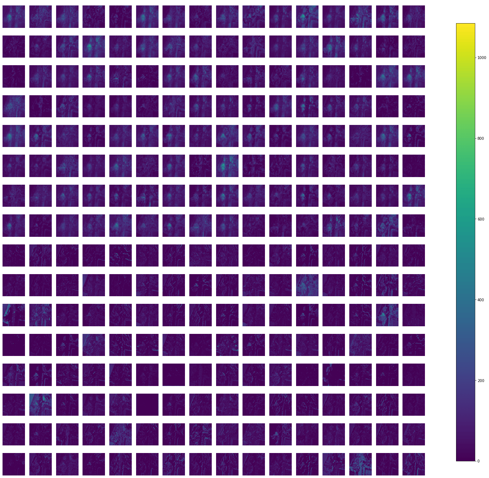
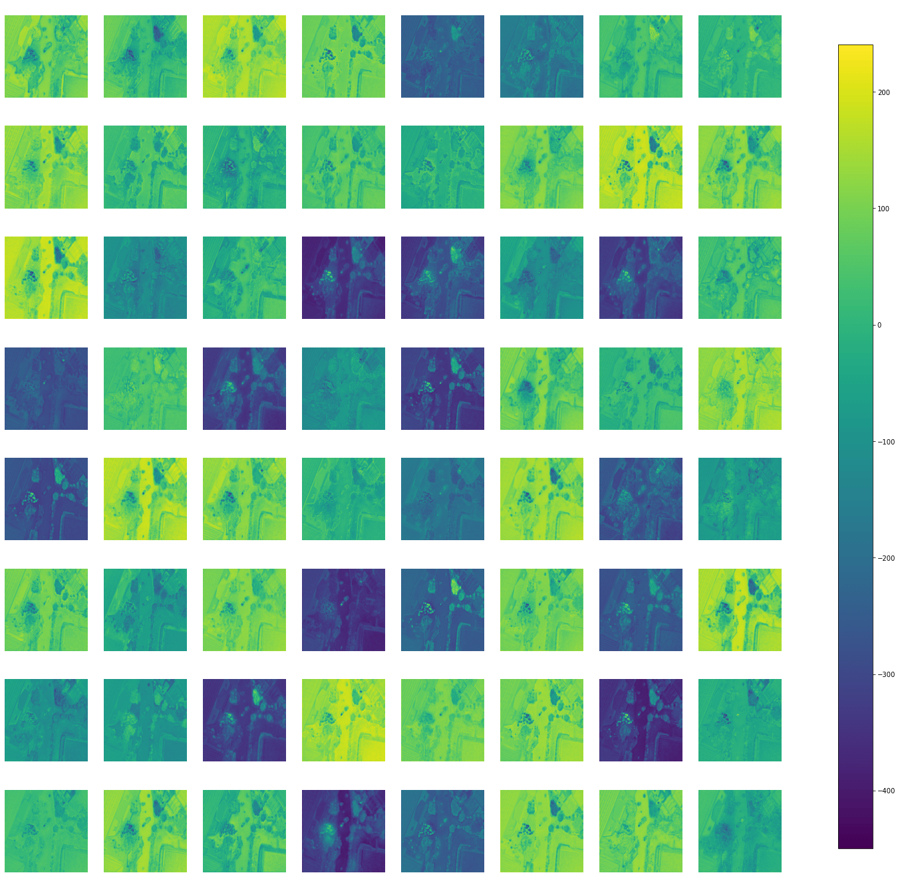
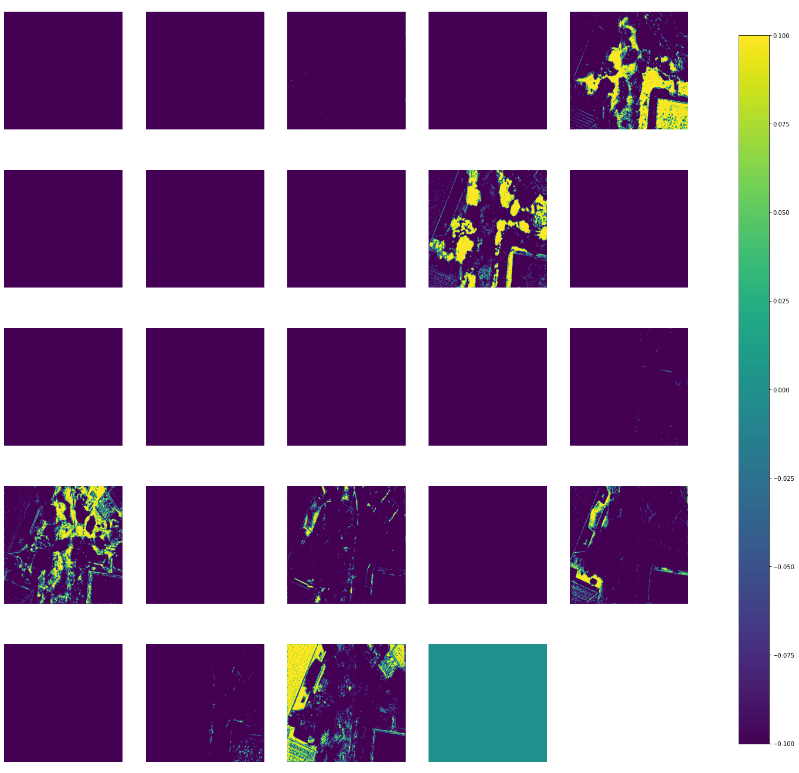

  

  

# Multiclass Semantic Segmentation of Aerial Drone Images Using Deep Learning

## Abstract

Semantic segmentation is the task of clustering parts of an image together which belong to the same object class. It is a form of pixel-level prediction because each pixel in an image is classified according to a category. In this project, I have performed semantic segmentation on <a href="http://dronedataset.icg.tugraz.at/">Semantic Drone Dataset</a> by using transfer learning on a VGG-16 backbone (trained on ImageNet) based UNet CNN model. In order to artificially increase the amount of data and avoid overfitting, I preferred using data augmentation on the training set. The model performed well, and achieved ~87% dice coefficient on the validation set.

## Tech Stack

|<a href="https://www.python.org/">

</a>|<a href="https://jupyter.org/">

</a>|<a href="https://ipython.org/">

</a>|<a href="https://numpy.org/">

</a>|<a href="https://pandas.pydata.org/">

</a>|
|---|---|---|---|---|

|<a href="https://matplotlib.org/">

</a>|<a href="https://opencv.org/">

</a>|<a href="https://albumentations.ai/">

</a>|<a href="https://keras.io/">

</a>|<a href="https://www.tensorflow.org/">

</a>|<a href="https://github.com/philipperemy/keract">

</a>|
|---|---|---|---|---|---|

The Jupyter Notebook can be accessed from <a href="./semantic-drone-dataset-vgg16-unet.ipynb">here</a>.

## What is Semantic Segmentation?

Semantic segmentation is the task of classifying each and very pixel in an image into a class as shown in the image below. Here we can see that all persons are red, the road is purple, the vehicles are blue, street signs are yellow etc.

Semantic segmentation is different from instance segmentation which is that different objects of the same class will have different labels as in person1, person2 and hence different colours.

<!-- ## Applications

1.  **Medical Images**

    
Automated segmentation of body scans can help doctors to perform diagnostic tests. For example, models can be trained to segment tumor.

    
  

2.  **Autonomous Vehicles**

    
Autonomous vehicles such as self-driving cars and drones can benefit from automated segmentation. For example, self-driving cars can detect drivable regions.

    
 
     
    

3.  **Satellite Image Analysis**

    
Aerial images can be used to segment different types of land. Automated land mapping can also be done.

    
 
     
    
 -->

## Semantic Drone Dataset

The <a href="http://dronedataset.icg.tugraz.at/">Semantic Drone Dataset</a> focuses on semantic understanding of urban scenes for increasing the safety of autonomous drone flight and landing procedures. The imagery depicts more than 20 houses from nadir (bird's eye) view acquired at an altitude of 5 to 30 meters above ground. A high resolution camera was used to acquire images at a size of 6000x4000px (24Mpx). The training set contains 400 publicly available images and the test set is made up of 200 private images.

  

 

### Semantic Annotation

The images are labeled densely using polygons and contain the following 24 classes:

<!-- | Name        | R   | G   | B   | Color                                                                                           |
| ----------- | --- | --- | --- | ----------------------------------------------------------------------------------------------- |
| unlabeled   | 0   | 0   | 0   | <svg width="30" height="20"><rect width="30" height="20" style="fill:rgb(0,0,0)" /></svg>       |
| paved-area  | 128 | 64  | 128 | <svg width="30" height="20"><rect width="30" height="20" style="fill:rgb(128,64,128)" /></svg>  |
| dirt        | 130 | 76  | 0   | <svg width="30" height="20"><rect width="30" height="20" style="fill:rgb(130,76,0)" /></svg>    |
| grass       | 0   | 102 | 0   | <svg width="30" height="20"><rect width="30" height="20" style="fill:rgb(0,102,0)" /></svg>     |
| gravel      | 112 | 103 | 87  | <svg width="30" height="20"><rect width="30" height="20" style="fill:rgb(112,103,87)" /></svg>  |
| water       | 28  | 42  | 168 | <svg width="30" height="20"><rect width="30" height="20" style="fill:rgb(28,42,168)" /></svg>   |
| rocks       | 48  | 41  | 30  | <svg width="30" height="20"><rect width="30" height="20" style="fill:rgb(48,41,30)" /></svg>    |
| pool        | 0   | 50  | 89  | <svg width="30" height="20"><rect width="30" height="20" style="fill:rgb(0,50,89)" /></svg>     |
| vegetation  | 107 | 142 | 35  | <svg width="30" height="20"><rect width="30" height="20" style="fill:rgb(107,142,35)" /></svg>  |
| roof        | 70  | 70  | 70  | <svg width="30" height="20"><rect width="30" height="20" style="fill:rgb(70,70,70)" /></svg>    |
| wall        | 102 | 102 | 156 | <svg width="30" height="20"><rect width="30" height="20" style="fill:rgb(102,102,156)" /></svg> |
| window      | 254 | 228 | 12  | <svg width="30" height="20"><rect width="30" height="20" style="fill:rgb(254,228,12)" /></svg>  |
| door        | 254 | 148 | 12  | <svg width="30" height="20"><rect width="30" height="20" style="fill:rgb(254,148,12)" /></svg>  |
| fence       | 190 | 153 | 153 | <svg width="30" height="20"><rect width="30" height="20" style="fill:rgb(190,153,153)" /></svg> |
| fence-pole  | 153 | 153 | 153 | <svg width="30" height="20"><rect width="30" height="20" style="fill:rgb(153,153,153)" /></svg> |
| person      | 255 | 22  | 0   | <svg width="30" height="20"><rect width="30" height="20" style="fill:rgb(255,22,0)" /></svg>    |
| dog         | 102 | 51  | 0   | <svg width="30" height="20"><rect width="30" height="20" style="fill:rgb(102,51,0)" /></svg>    |
| car         | 9   | 143 | 150 | <svg width="30" height="20"><rect width="30" height="20" style="fill:rgb(9,143,150)" /></svg>   |
| bicycle     | 119 | 11  | 32  | <svg width="30" height="20"><rect width="30" height="20" style="fill:rgb(119,11,32)" /></svg>   |
| tree        | 51  | 51  | 0   | <svg width="30" height="20"><rect width="30" height="20" style="fill:rgb(51,51,0)" /></svg>     |
| bald-tree   | 190 | 250 | 190 | <svg width="30" height="20"><rect width="30" height="20" style="fill:rgb(190,250,190)" /></svg> |
| ar-marker   | 112 | 150 | 146 | <svg width="30" height="20"><rect width="30" height="20" style="fill:rgb(112,150,146)" /></svg> |
| obstacle    | 2   | 135 | 115 | <svg width="30" height="20"><rect width="30" height="20" style="fill:rgb(2,135,115)" /></svg>   |
| conflicting | 255 | 0   | 0   | <svg width="30" height="20"><rect width="30" height="20" style="fill:rgb(255,0,0)" /></svg>     | -->

| Name        | R   | G   | B   | Color                                                                                        |
| ----------- | --- | --- | --- | -------------------------------------------------------------------------------------------- |
| unlabeled   | 0   | 0   | 0   | 

   |
| paved-area  | 128 | 64  | 128 | 

  |
| dirt        | 130 | 76  | 0   | 

        |
| grass       | 0   | 102 | 0   | 

       |
| gravel      | 112 | 103 | 87  | 

      |
| water       | 28  | 42  | 168 | 

       |
| rocks       | 48  | 41  | 30  | 

       |
| pool        | 0   | 50  | 89  | 

        |
| vegetation  | 107 | 142 | 35  | 

  |
| roof        | 70  | 70  | 70  | 

        |
| wall        | 102 | 102 | 156 | 

        |
| window      | 254 | 228 | 12  | 

      |
| door        | 254 | 148 | 12  | 

        |
| fence       | 190 | 153 | 153 | 

       |
| fence-pole  | 153 | 153 | 153 | 

  |
| person      | 255 | 22  | 0   | 

      |
| dog         | 102 | 51  | 0   | 

         |
| car         | 9   | 143 | 150 | 

         |
| bicycle     | 119 | 11  | 32  | 

     |
| tree        | 51  | 51  | 0   | 

        |
| bald-tree   | 190 | 250 | 190 | 

   |
| ar-marker   | 112 | 150 | 146 | 

   |
| obstacle    | 2   | 135 | 115 | 

    |
| conflicting | 255 | 0   | 0   | 

 |

### Sample Images

## Technical Approach

### Data Augmentation using Albumentations Library

<a href="https://albumentations.ai/">Albumentations</a> is a Python library for fast and flexible image augmentations. Albumentations efficiently implements a rich variety of image transform operations that are optimized for performance, and does so while providing a concise, yet powerful image augmentation interface for different computer vision tasks, including object classification, segmentation, and detection.

There are only 400 images in the dataset, out of which I have used 320 images (80%) for training set and remaining 80 images (20%) for validation set. It is a relatively small amount of data, in order to artificially increase the amount of data and avoid overfitting, I preferred using data augmentation. By doing so I have increased the training data upto 5 times. So, the total number of images in the training set is 1600, and 80 images in the validation set, after data augmentation.

Data augmentation is achieved through the following techniques:

- Random Cropping
- Horizontal Flipping
- Vertical Flipping
- Rotation
- Random Brightness & Contrast
- Contrast Limited Adaptive Histogram Equalization (CLAHE)
- Grid Distortion
- Optical Distortion

Here are some sample augmented images and masks of the dataset:

 

 

 

### VGG-16 Encoder based UNet Model

The <a href="https://arxiv.org/abs/1505.04597">UNet</a> was developed by Olaf Ronneberger et al. for Bio Medical Image Segmentation. The architecture contains two paths. First path is the contraction path (also called as the encoder) which is used to capture the context in the image. The encoder is just a traditional stack of convolutional and max pooling layers. The second path is the symmetric expanding path (also called as the decoder) which is used to enable precise localization using transposed convolutions. Thus, it is an end-to-end fully convolutional network (FCN), i.e. it only contains Convolutional layers and does not contain any Dense layer because of which it can accept image of any size.

In the original paper, the UNet is described as follows:

<i>U-Net architecture (example for 32x32 pixels in the lowest resolution). Each blue box corresponds to a multi-channel feature map. The number of channels is denoted on top of the box. The x-y-size is provided at the lower left edge of the box. White boxes represent copied feature maps. The arrows denote the different operations.</i>

#### Custom VGG16-UNet Architecture

- VGG16 model pre-trained on the ImageNet dataset has been used as an Encoder network.

- A Decoder network has been extended from the last layer of the pre-trained model, and it is concatenated to the consecutive convolution blocks.

<i>VGG16 Encoder based UNet CNN Architecture</i>

A detailed layout of the model is available [here](./vgg16_unet_plot.png).

### Hyper-Parameters

1. Batch Size = 8
2. Steps per Epoch = 200.0
3. Validation Steps = 10.0
4. Input Shape = (512, 512, 3)
5. Initial Learning Rate = 0.0001 (with Exponential Decay LearningRateScheduler callback)
6. Number of Epochs = 20 (with ModelCheckpoint & EarlyStopping callback)

## Results

### Training Results

|   Model    |                   Epochs                   | Train Dice Coefficient | Train Loss | Val Dice Coefficient | Val Loss |    Max. (Initial) LR    |         Min. LR         | Total Training Time |
| :--------: | :----------------------------------------: | :--------------------: | :--------: | :------------------: | :------: | :---------------------: | :---------------------: | :-----------------: |
| VGG16-UNet | 20 (best weights at 18th epoch) |         0.8781         |   0.2599   |        0.8702        | 0.29959  | 1.000 × 10-4 | 1.122 × 10-5 | 23569 s (06:32:49)  |

The <a href="https://github.com/ayushdabra/drone-images-semantic-segmentation/blob/main/model_training_csv.log">`model_training_csv.log`</a> file contain epoch wise training details of the model.

### Visual Results

Predictions on Validation Set Images:

All predictions on the validation set are available in the <a href="https://github.com/ayushdabra/drone-images-semantic-segmentation/tree/main/predictions">`predictions`</a> directory.

## Activations (Outputs) Visualization

Activations/Outputs of some layers of the model-

| 
<b>block1_conv1</b>
    | 
<b>block4_conv1</b>
              | 
<b>conv2d_transpose</b>
 | 
<b>concatenate</b>
                |
| ----------------------------------------------------------------------------------------------------------------------------------- | --------------------------------------------------------------------------------------------------------------------------------------------- | ---------------------------------------------------------------------------------------------------------------------------------------- | --------------------------------------------------------------------------------------------------------------------------------------------- |
| 
<b>conv2d</b>
                | 
<b>conv2d_transpose_1</b>
 | 
<b>conv2d_3</b>
                | 
<b>conv2d_transpose_2</b>
 |
| 
<b>concatenate_2</b>
 | 
<b>conv2d_5</b>
                     | 
<b>conv2d_7</b>
                | 
<b>conv2d_8</b>
                     |

Some more activation maps are available in the <a href="https://github.com/ayushdabra/drone-images-semantic-segmentation/tree/main/activations">`activations`</a> directory.

## References

1. Semantic Drone Dataset- http://dronedataset.icg.tugraz.at/
2. Karen Simonyan and Andrew Zisserman, "**Very Deep Convolutional Networks for Large-Scale Image Recognition**", arXiv:1409.1556, 2014. [\[PDF\]](https://arxiv.org/pdf/1409.1556v6.pdf)
3. Olaf Ronneberger, Philipp Fischer and Thomas Brox, "**U-Net: Convolutional Networks for Biomedical Image Segmentation**", arXiv:1505. 04597, 2015. [\[PDF\]](https://arxiv.org/pdf/1505.04597.pdf)
4. Towards Data Science- [Understanding Semantic Segmentation with UNET](https://towardsdatascience.com/understanding-semantic-segmentation-with-unet-6be4f42d4b47), by Harshall Lamba
5. Keract by Philippe Rémy [\(@github/philipperemy\)](https://github.com/philipperemy/keract) used under the IT License Copyright (c) 2019.
